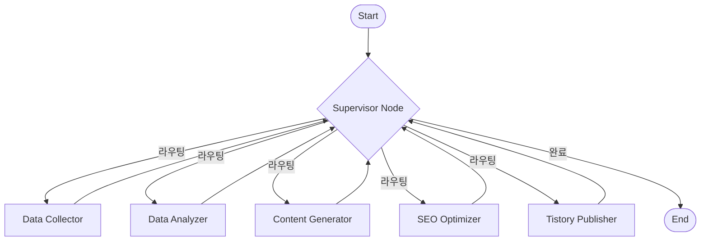

# 🔄 에이전트 워크플로우 (LangGraph)

## 전체 흐름도

---

## Supervisor 라우팅 로직

Superviosr는 `SupervisorState`의 현재 상태를 보고 다음 작업을 결정합니다.

| 조건 | 다음 액션 (Worker) | 설명 |
|---|---|---|
| `raw_articles` 없음 | **COLLECT_DATA** | 수집된 기사가 없으면 수집부터 시작 |
| `policy_issues` 없음 | **ANALYZE_DATA** | 기사는 있으나 분석 결과가 없으면 분석 수행 |
| `final_content` 없음 | **GENERATE_CONTENT** | 분석 완료 후 콘텐츠가 없으면 초안 생성 |
| `seo_score` < 목표점수 | **OPTIMIZE_SEO** | SEO 점수가 목표 미달이면 최적화 (최대 3회) |
| 발행 URL 없음 (선택) | **PUBLISH_CONTENT** | (옵션) 모든 작업 완료 시 자동 발행 |
| 모든 조건 충족 | **FINISH** | 워크플로우 종료 |

---

## Worker별 처리 내용

### 1. Data Collector (`COLLECT_DATA`)
1. 사용자 쿼리에서 지역명 파싱 (예: "강남역" → "강남구 역삼동")
2. 지역명 파싱 실패 시 쿼리 그대로 사용
3. 네이버 뉴스 API로 관련 기사 검색 (최신순)
4. 결과: `raw_articles` 상태 업데이트

### 2. Data Analyzer (`ANALYZE_DATA`)
1. 수집된 기사를 LLM으로 분류 (교통, 인프라, 정책 등)
2. 부동산과 관련 없는 기사 필터링
3. 카테고리별 핵심 이슈 추출 (제목, 요약, 중요도, 호재/악재 감성)
4. 결과: `classified_articles`, `policy_issues` 상태 업데이트

### 3. Content Generator (`GENERATE_CONTENT`)
1. 정책 이슈를 바탕으로 블로그 글 초안 작성 (Markdown)
2. 제목, 본문, 태그, 메타 설명 생성
3. (옵션) DALL-E 이미지 생성 및 삽입
4. 결과: `final_content` 상태 업데이트

### 4. SEO Optimizer (`OPTIMIZE_SEO`)
1. 현재 콘텐츠의 SEO 점수 측정 (결정적 알고리즘)
2. 점수가 목표보다 낮으면 LLM으로 문제점 분석 및 개선
3. 개선된 내용으로 콘텐츠 업데이트 및 점수 재측정
4. 결과: `seo_score`, `final_content` 업데이트

### 5. Tistory Publisher (`PUBLISH_CONTENT`)
1. Selenium으로 티스토리 로그인
2. 글 작성 폼에 제목, 본문, 태그 입력
3. 발행 버튼 클릭
4. 결과: `post_url` 상태 업데이트
