# PublicDataBase 상속 모델 + Lot ERD

```mermaid
erDiagram
    %% ============================================
    %% 중심 테이블: Lot (필지)
    %% ============================================
    Lot {
        string pnu PK "필지고유번호"
        geometry geometry "PostGIS Polygon/MultiPolygon"

        datetime created_at
    }

    %% ============================================
    %% 토지 관련 (land.py)
    %% ============================================
    LandCharacteristic {
        int id PK
        string pnu FK "필지고유번호"
        string jimok "지목명"
        float land_area "토지면적(m2)"
        string use_zone "용도지역명"
        string land_use "토지이용상황"
        int official_price "공시지가(원)"

        datetime created_at
    }

    LandUsePlan {
        int id PK
        string pnu FK "필지고유번호"
        string use_district_name "용도지역지구명"

        datetime created_at
    }

    LandAndForestInfo {
        int id PK
        string pnu FK "필지고유번호"
        string jimok "지목명"
        float area "면적(m2)"
        string ownership "소유구분명"
        int owner_count "소유(공유)인수"

        datetime created_at
    }

    %% ============================================
    %% 토지소유 (land_ownership.py)
    %% ============================================
    LandOwnership {
        int id PK
        string pnu FK "필지고유번호"
        string base_year_month "기준연월 (YYYY-MM)"
        string co_owner_seq "공유인일련번호"
        string ownership_type "소유구분"
        string ownership_change_reason "소유권변동원인"
        string ownership_change_date "소유권변동일자"
        int owner_count "공유인수"


        datetime created_at
        datetime updated_at
    }

    %% ============================================
    %% 공시지가 (transaction.py)
    %% ============================================
    OfficialLandPrice {
        int id PK
        string pnu FK "필지고유번호"
        int base_year "기준연도"
        int price_per_sqm "공시지가(원/m2)"


        datetime created_at
        datetime updated_at
    }

    %% ============================================
    %% 실거래 - 매매 (transaction.py)
    %% ============================================
    RealEstateSale {
        int id PK
        enum property_type "부동산유형 (NOT NULL)"
        string sigungu "시군구"
        string building_name "건물명"
        float exclusive_area "전용면적(m2)"
        float land_area "대지면적(m2)"
        float floor_area "연면적(m2)"
        string floor "층"
        int build_year "건축년도"
        date transaction_date "거래일"
        int transaction_amount "거래금액(만원)"
        string deal_type "거래유형"

        datetime created_at
    }

    %% ============================================
    %% 실거래 - 전월세 (transaction.py)
    %% ============================================
    RealEstateRental {
        int id PK
        enum property_type "부동산유형 (NOT NULL)"
        enum transaction_type "전세/월세 (NOT NULL)"
        string sigungu "시군구"
        string building_name "건물명"
        float exclusive_area "전용면적(m2)"
        float land_area "대지면적(m2)"
        float floor_area "연면적(m2)"
        string floor "층"
        int build_year "건축년도"
        date transaction_date "거래일"
        int deposit "보증금(만원)"
        int monthly_rent_amount "월세금(만원)"
        string contract_period "계약기간"
        string contract_type "계약구분"
        string deal_type "거래유형"

        datetime created_at
    }

    %% ============================================
    %% 건물 (building.py)
    %% ============================================
    BuildingRegisterHeader {
        int id PK
        string mgm_bldrgst_pk "관리 건축물대장 PK (UQ)"
        string pnu FK "필지고유번호"
        string building_name "건물명"
        float site_area "대지면적(m2)"
        float building_area "건축면적(m2)"
        float bcr "건폐율(%)"
        float total_floor_area "연면적(m2)"
        float far "용적률(%)"
        string structure_name "구조코드명"
        string main_use_name "주용도코드명"
        int household_count "세대수"
        float height "높이(m)"
        int above_ground_floors "지상층수"
        int underground_floors "지하층수"
        string approval_date "사용승인일"


        datetime created_at
        datetime updated_at
    }

    BuildingRegisterGeneral {
        int id PK
        string mgm_bldrgst_pk "관리 건축물대장 PK (UQ)"
        string pnu FK "필지고유번호"
        string building_name "건물명"
        float site_area "대지면적(m2)"
        float building_area "건축면적(m2)"
        float bcr "건폐율(%)"
        float total_floor_area "연면적(m2)"
        float far "용적률(%)"
        string main_use_name "주용도코드명"
        int household_count "세대수"
        int total_parking "총주차수"
        string approval_date "사용승인일"


        datetime created_at
        datetime updated_at
    }

    BuildingRegisterFloorDetail {
        int id PK
        string mgm_bldrgst_pk "관리 건축물대장 PK"
        string pnu FK "필지고유번호"
        string floor_type_name "층구분코드명"
        int floor_no "층번호"
        string main_use_name "주용도코드명"
        float area "면적(m2)"


        datetime created_at
        datetime updated_at
    }

    BuildingRegisterArea {
        int id PK
        string mgm_bldrgst_pk "관리 건축물대장 PK"
        string pnu FK "필지고유번호"
        string dong_name "동명"
        string ho_name "호명"
        int floor_no "층번호"
        string exclu_common_type "전유공용구분 (1:전유, 2:공용)"
        float area "면적(m2)"


        datetime created_at
        datetime updated_at
    }

    BuildingRegisterAncillaryLot {
        int id PK
        string mgm_bldrgst_pk "관리 건축물대장 PK"
        string pnu FK "필지고유번호 (본 건물)"
        string atch_pnu "부속 필지고유번호"
        string created_date "생성일자"


        datetime created_at
        datetime updated_at
    }

    GisBuildingIntegrated {
        int id PK
        string pnu FK "필지고유번호"
        string use_name "건축물용도명"
        float building_area "건축물면적(m2)"
        string approval_date "사용승인일자"
        float total_floor_area "연면적(m2)"
        float site_area "대지면적(m2)"
        float height "높이(m)"
        string building_id "건축물ID (UQ with pnu)"
        string building_name "건물명"
        int above_ground_floors "지상층수"
        int underground_floors "지하층수"
        geometry geometry "PostGIS Polygon/MultiPolygon"


        datetime created_at
        datetime updated_at
    }

    %% ============================================
    %% 부속필지 (lot.py)
    %% ============================================
    AncillaryLand {
        int id PK
        string pnu FK "필지고유번호"


        datetime created_at
        datetime updated_at
    }

    %% ============================================
    %% 행정경계 (administrative.py)
    %% ============================================
    AdministrativeDivision {
        int id PK
        string code UK "행정경계코드 (2~5자리)"
        string name "행정경계명"
        int level "레벨 (1=시도, 2=시군구)"
        string parent_code "상위 행정경계코드"
        geometry geometry "PostGIS Polygon/MultiPolygon"


        datetime created_at
        datetime updated_at
    }

    AdministrativeEmd {
        int id PK
        string code UK "읍면동코드 (8~10자리)"
        string name "읍면동명"
        string division_code FK "소속 시군구코드"
        geometry geometry "PostGIS Polygon/MultiPolygon"


        datetime created_at
        datetime updated_at
    }

    %% ============================================
    %% 공간 데이터 (spatial.py)
    %% ============================================
    RoadCenterLine {
        int id PK
        string source_id "원본 피처 ID"
        string road_name "도로명"
        geometry geometry "PostGIS LineString/MultiLineString"

        datetime created_at
    }

    UseRegionDistrict {
        int id PK
        string source_id "원본 피처 ID"
        string district_name "용도지역/지구/구역명"
        string district_code "용도지역/지구/구역코드"
        string admin_code "관할 행정경계코드"
        geometry geometry "PostGIS Polygon/MultiPolygon"


        datetime created_at
        datetime updated_at
    }

    %% ============================================
    %% 관계 (Relationships)
    %% ============================================

    %% Lot 중심 FK 관계 (pnu 기반)
    Lot ||--o{ LandCharacteristic : "pnu -> lots.pnu"
    Lot ||--o{ LandUsePlan : "pnu -> lots.pnu"
    Lot ||--o{ LandAndForestInfo : "pnu -> lots.pnu"
    Lot ||--o{ LandOwnership : "pnu -> lots.pnu"
    Lot ||--o{ OfficialLandPrice : "pnu -> lots.pnu"
    Lot ||--o{ BuildingRegisterHeader : "pnu -> lots.pnu"
    Lot ||--o{ BuildingRegisterGeneral : "pnu -> lots.pnu"
    Lot ||--o{ BuildingRegisterFloorDetail : "pnu -> lots.pnu"
    Lot ||--o{ BuildingRegisterArea : "pnu -> lots.pnu"
    Lot ||--o{ BuildingRegisterAncillaryLot : "pnu -> lots.pnu"
    Lot ||--o{ GisBuildingIntegrated : "pnu -> lots.pnu"
    Lot ||--o{ AncillaryLand : "pnu -> lots.pnu"

    %% 행정경계 계층 관계
    AdministrativeDivision ||--o{ AdministrativeEmd : "code -> division_code"
```

## 요약

| 구분   | 테이블                             | 설명                           | Lot FK | UQ 제약            |
| ------ | ---------------------------------- | ------------------------------ | ------ | ------------------ |
| 중심   | `lots`                             | 필지 (PNU 기준)                | -      | pnu (PK)           |
| 토지   | `land_characteristics`             | 토지특성정보 (AL_D195)         | O      | pnu               |
| 토지   | `land_use_plans`                   | 토지이용계획정보 (AL_D154)     | O      | pnu + use_district_name |
| 토지   | `land_and_forest_infos`            | 토지임야정보 (AL_D003)         | O      | pnu               |
| 소유   | `land_ownerships`                  | 토지소유정보                   | O      | pnu + co_owner_seq |
| 가격   | `official_land_prices`             | 개별공시지가 (AL_D151)         | O      | pnu + base_year    |
| 매매   | `real_estate_sales`                | 부동산 매매 실거래             | X      | -                  |
| 전월세 | `real_estate_rentals`              | 부동산 전월세 실거래           | X      | -                  |
| 건물   | `building_register_headers`        | 건축물대장 표제부              | O      | mgm_bldrgst_pk     |
| 건물   | `building_register_generals`       | 건축물대장 총괄표제부          | O      | mgm_bldrgst_pk     |
| 건물   | `building_register_floor_details`  | 건축물대장 층별개요            | O      | -                  |
| 건물   | `building_register_areas`          | 건축물대장 전유공용면적        | O      | -                  |
| 건물   | `building_register_ancillary_lots` | 건축물대장 부속지번            | O      | -                  |
| 건물   | `gis_building_integrated`          | GIS건물통합정보 (AL_D010, SHP) | O      | pnu + building_id  |
| 필지   | `ancillary_lands`                  | 부속필지                       | O      | -                  |
| 행정   | `administrative_divisions`         | 행정경계 (시도/시군구)         | X      | code               |
| 행정   | `administrative_emds`              | 읍면동                         | X      | code               |
| 공간   | `road_center_lines`                | 도로중심선                     | X      | -                  |
| 공간   | `use_region_districts`             | 용도지역지구                   | X      | -                  |

### 핵심 관계

- **Lot**이 PNU 기반 중심 테이블로, 12개 테이블이 pnu로 연결 (FK 없이 인덱스 기반)
- **RealEstateSale, RealEstateRental**: sigungu 기반 위치 연결 (pnu 없음)
- **AdministrativeDivision -> AdministrativeEmd**: 시군구 -> 읍면동 계층 관계
- **RoadCenterLine, UseRegionDistrict**: 공간 데이터 (Lot과 직접 연결 없음)
- 모든 PublicDataBase 상속 테이블은 `id`, `created_at` 공통 필드 보유
- PNU에서 시도/시군구/읍면동 코드 추출: `app.utils.pnu` 유틸 사용
- PostGIS geometry 지원: Lot, AdministrativeDivision, AdministrativeEmd, GisBuildingIntegrated, RoadCenterLine, UseRegionDistrict

### Enum 타입

| Enum            | 값                                                                |
| --------------- | ----------------------------------------------------------------- |
| PropertyType    | land, commercial, detached_house, row_house, apartment, officetel |
| TransactionType | jeonse, monthly_rent                                              |

### 데이터 소스

| 소스           | 포맷        | 테이블                                                                                                                           |
| -------------- | ----------- | -------------------------------------------------------------------------------------------------------------------------------- |
| vworld CSV     | csv (cp949) | LandCharacteristic, LandUsePlan, LandAndForestInfo, OfficialLandPrice                                                            |
| vworld SHP     | shp         | GisBuildingIntegrated, RoadCenterLine, UseRegionDistrict, AdministrativeDivision, AdministrativeEmd                              |
| 공공데이터포털 | API/txt     | BuildingRegisterHeader, BuildingRegisterGeneral, BuildingRegisterFloorDetail, BuildingRegisterArea, BuildingRegisterAncillaryLot |
| rt.molit.go.kr | csv/api     | RealEstateSale, RealEstateRental                                                                                                 |
| 연속지적도     | shp         | Lot, AncillaryLand                                                                                                               |
| 공공데이터포털 | API         | LandOwnership                                                                                                                    |
