# PublicDataBase 상속 모델 + Lot ERD

```mermaid
erDiagram
    %% ============================================
    %% 중심 테이블: Lot (필지 + 토지 통합)
    %% ============================================
    Lot {
        string pnu PK "필지고유번호 (19자리)"
        geometry geometry "PostGIS Polygon/MultiPolygon"
        datetime created_at

        string jimok "지목명"

        float area "면적(m2)"
        string use_zone "용도지역명"
        string land_use "토지이용상황"
        bigint official_price "공시지가(원)"
        string ownership "소유구분명"
        int owner_count "소유(공유)인수"

        jsonb use_plans "토지이용계획 [{use_district_name}]"
        jsonb ownerships "토지소유 [{base_year_month, co_owner_seq, ...}]"
        jsonb official_prices "공시지가 [{base_year, price_per_sqm}]"
        jsonb ancillary_lots "부속지번 [{mgm_bldrgst_pk, atch_pnu, created_date}]"
    }

    %% ============================================
    %% 실거래 - 매매 (transaction.py)
    %% ============================================
    RealEstateSale {
        int id PK
        enum property_type "부동산유형 (NOT NULL)"
        string address "주소 (시군구 + 번지)"
        string sgg_code "시군구코드 (5자리)"
        string building_name "단지명/건물명"
        float exclusive_area "전용면적(m2)"
        float land_area "대지면적(m2)"
        float floor_area "연면적(m2)"
        string floor "층"
        int build_year "건축년도"
        date transaction_date "계약일"
        bigint transaction_amount "거래금액(만원)"
        string deal_type "거래유형"
        datetime created_at
    }

    %% ============================================
    %% 실거래 - 전월세 (transaction.py)
    %% ============================================
    RealEstateRental {
        int id PK
        enum property_type "부동산유형 (NOT NULL)"
        enum transaction_type "전세/월세 (NOT NULL)"
        string address "주소 (시군구 + 번지)"
        string sgg_code "시군구코드 (5자리)"
        string building_name "단지명/건물명"
        float exclusive_area "전용면적(m2)"
        float land_area "대지면적(m2)"
        float floor_area "연면적(m2)"
        string floor "층"
        int build_year "건축년도"
        date transaction_date "계약일"
        bigint deposit "보증금(만원)"
        bigint monthly_rent_amount "월세금(만원)"
        string contract_period "계약기간"
        string contract_type "계약구분"
        string deal_type "거래유형"
        datetime created_at
    }

    %% ============================================
    %% 건물 (building.py)
    %% ============================================
    BuildingRegisterHeader {
        int id PK
        string mgm_bldrgst_pk "관리 건축물대장 PK (UQ)"
        string pnu "필지고유번호"
        string building_name "건물명"
        float site_area "대지면적(m2)"
        float building_area "건축면적(m2)"
        float bcr "건폐율(%)"
        float total_floor_area "연면적(m2)"
        float far "용적률(%)"
        string structure_name "구조코드명"
        string main_use_name "주용도코드명"
        int household_count "세대수"
        float height "높이(m)"
        int above_ground_floors "지상층수"
        int underground_floors "지하층수"
        string approval_date "사용승인일"
        datetime created_at
    }

    BuildingRegisterGeneral {
        int id PK
        string mgm_bldrgst_pk "관리 건축물대장 PK (UQ)"
        string pnu "필지고유번호"
        string building_name "건물명"
        float site_area "대지면적(m2)"
        float building_area "건축면적(m2)"
        float bcr "건폐율(%)"
        float total_floor_area "연면적(m2)"
        float far "용적률(%)"
        string main_use_name "주용도코드명"
        int household_count "세대수"
        int total_parking "총주차수"
        string approval_date "사용승인일"
        datetime created_at
    }

    BuildingRegisterFloorDetail {
        int id PK
        string mgm_bldrgst_pk "관리 건축물대장 PK"
        string pnu "필지고유번호"
        string floor_type_name "층구분코드명"
        int floor_no "층번호"
        string main_use_name "주용도코드명"
        float area "면적(m2)"
        datetime created_at
    }

    BuildingRegisterArea {
        int id PK
        string mgm_bldrgst_pk "관리 건축물대장 PK"
        string pnu "필지고유번호"
        string dong_name "동명"
        string ho_name "호명"
        int floor_no "층번호"
        string exclu_common_type "전유공용구분 (1:전유, 2:공용)"
        float area "면적(m2)"
        datetime created_at
    }

    GisBuildingIntegrated {
        int id PK
        string pnu "필지고유번호"
        string use_name "건축물용도명"
        float building_area "건축물면적(m2)"
        string approval_date "사용승인일자"
        float total_floor_area "연면적(m2)"
        float site_area "대지면적(m2)"
        float height "높이(m)"
        string building_id "건축물ID (UQ with pnu)"
        string building_name "건물명"
        int above_ground_floors "지상층수"
        int underground_floors "지하층수"
        geometry geometry "PostGIS Polygon/MultiPolygon"
        datetime created_at
    }

    %% ============================================
    %% 행정경계 (administrative.py)
    %% ============================================
    AdministrativeSido {
        int id PK
        string sido_code UK "시도코드 (2자리)"
        string name "시도명"
        geometry geometry "PostGIS Polygon/MultiPolygon"
        datetime created_at
    }

    AdministrativeSgg {
        int id PK
        string sgg_code UK "시군구코드 (5자리)"
        string name "시군구명"
        string sido_code "소속 시도코드 (2자리)"
        geometry geometry "PostGIS Polygon/MultiPolygon"
        datetime created_at
    }

    AdministrativeEmd {
        int id PK
        string emd_code UK "읍면동코드 (8~10자리)"
        string name "읍면동명"
        string sgg_code "소속 시군구코드 (5자리)"
        geometry geometry "PostGIS Polygon/MultiPolygon"
        datetime created_at
    }

    %% ============================================
    %% 공간 데이터 (spatial.py)
    %% ============================================
    RoadCenterLine {
        int id PK
        string source_id "원본 피처 ID (UQ)"
        string road_name "도로명"
        geometry geometry "PostGIS LineString/MultiLineString"
        datetime created_at
    }

    UseRegionDistrict {
        int id PK
        string source_id "원본 피처 ID (UQ)"
        string district_name "용도지역/지구/구역명"
        string district_code "용도지역/지구/구역코드"
        string admin_code "관할 행정경계코드"
        geometry geometry "PostGIS Polygon/MultiPolygon"
        datetime created_at
    }

    %% ============================================
    %% 관계 (Relationships)
    %% ============================================

    %% Lot 중심 (pnu 기반, FK 없이 인덱스 기반)
    Lot ||--o{ BuildingRegisterHeader : "pnu"
    Lot ||--o{ BuildingRegisterGeneral : "pnu"
    Lot ||--o{ BuildingRegisterFloorDetail : "pnu"
    Lot ||--o{ BuildingRegisterArea : "pnu"
    Lot ||--o{ GisBuildingIntegrated : "pnu"

    %% 행정경계 계층 관계
    AdministrativeSido ||--o{ AdministrativeSgg : "sido_code"
    AdministrativeSgg ||--o{ AdministrativeEmd : "sgg_code"

    %% 실거래가 - 시군구 기반
    AdministrativeSgg ||--o{ RealEstateSale : "sgg_code"
    AdministrativeSgg ||--o{ RealEstateRental : "sgg_code"
```

## 요약

| 구분   | 테이블                            | 설명                           | Lot FK | UQ 제약                                     |
| ------ | --------------------------------- | ------------------------------ | ------ | ------------------------------------------- |
| 중심   | `lots`                            | 필지 + 토지 통합 (PNU 기준)    | -      | pnu (PK)                                    |
| 매매   | `real_estate_sales`               | 부동산 매매 실거래             | X      | -                                           |
| 전월세 | `real_estate_rentals`             | 부동산 전월세 실거래           | X      | -                                           |
| 건물   | `building_register_headers`       | 건축물대장 표제부              | O      | mgm_bldrgst_pk                              |
| 건물   | `building_register_generals`      | 건축물대장 총괄표제부          | O      | mgm_bldrgst_pk                              |
| 건물   | `building_register_floor_details` | 건축물대장 층별개요            | O      | mgm_bldrgst_pk + floor_type_name + floor_no |
| 건물   | `building_register_areas`         | 건축물대장 전유공용면적        | O      | mgm_bldrgst_pk + dong/ho/floor/exclu_common |
| 건물   | `gis_building_integrated`         | GIS건물통합정보 (AL_D010, SHP) | O      | pnu + building_id                           |
| 행정   | `administrative_sidos`            | 행정경계 시도                  | X      | sido_code                                   |
| 행정   | `administrative_sggs`             | 행정경계 시군구                | X      | sgg_code                                    |
| 행정   | `administrative_emds`             | 행정경계 읍면동                | X      | emd_code                                    |
| 공간   | `road_center_lines`               | 도로중심선                     | X      | source_id                                   |
| 공간   | `use_region_districts`            | 용도지역지구                   | X      | source_id                                   |

### Lot 통합 구조

| 구분         | 원본 테이블                      | 통합 방식     | 컬럼/키                                                                                   |
| ------------ | -------------------------------- | ------------- | ----------------------------------------------------------------------------------------- |
| 연속지적도   | (기반 데이터)                    | PK + geometry | pnu, geometry                                                                             |
| 토지특성     | land_characteristics             | flat 컬럼     | jimok, area, use_zone, land_use, official_price                                           |
| 토지임야     | land_and_forest_infos            | flat 컬럼     | ownership, owner_count                                                                    |
| 토지이용계획 | land_use_plans                   | JSONB         | use_plans `[{use_district_name}]`                                                         |
| 토지소유     | land_ownerships                  | JSONB         | ownerships `[{base_year_month, co_owner_seq, ...}]`                                       |
| 공시지가     | official_land_prices             | JSONB         | official_prices `[{base_year, price_per_sqm}]`                                            |
| 부속지번     | building_register_ancillary_lots | JSONB         | ancillary_lots `[{mgm_bldrgst_pk, atch_pnu, created_date}]`                               |

### 핵심 관계

- **Lot**이 PNU 기반 중심 테이블로, 5개 건물 테이블이 pnu로 연결 (FK 없이 인덱스 기반)
- **Lot**에 토지 관련 6개 테이블 데이터가 flat 컬럼 + JSONB로 통합됨
- **RealEstateSale, RealEstateRental**: sgg_code 기반 위치 연결 (pnu 없음)
- **AdministrativeSido → AdministrativeSgg → AdministrativeEmd**: 시도 → 시군구 → 읍면동 3단계 계층
- **RoadCenterLine, UseRegionDistrict**: 공간 데이터 (Lot과 직접 연결 없음)
- 모든 PublicDataBase 상속 테이블은 `id`, `created_at` 공통 필드 보유
- PNU에서 시도/시군구/읍면동 코드 추출: `app.utils.pnu` 유틸 사용
- PostGIS geometry 지원: Lot, AdministrativeSido/Sgg/Emd, GisBuildingIntegrated, RoadCenterLine, UseRegionDistrict

### 복합 인덱스

| 테이블                | 인덱스                | 컬럼                       |
| --------------------- | --------------------- | -------------------------- |
| `real_estate_sales`   | ix_sales_sgg_txdate   | sgg_code, transaction_date |
| `real_estate_rentals` | ix_rentals_sgg_txdate | sgg_code, transaction_date |

### Enum 타입

| Enum            | 값                                                                |
| --------------- | ----------------------------------------------------------------- |
| PropertyType    | land, commercial, detached_house, row_house, apartment, officetel |
| TransactionType | jeonse, monthly_rent                                              |

### 데이터 소스

| 소스           | 포맷        | 테이블                                                                                             |
| -------------- | ----------- | -------------------------------------------------------------------------------------------------- |
| 연속지적도     | shp         | Lot (기반 PNU + geometry)                                                                          |
| vworld CSV     | csv (cp949) | Lot (토지특성, 토지이용계획, 토지임야, 공시지가 → flat/JSONB 통합)                                 |
| vworld SHP     | shp         | GisBuildingIntegrated, RoadCenterLine, UseRegionDistrict, AdministrativeSido/Sgg/Emd               |
| 공공데이터포털 | txt         | BuildingRegisterHeader, BuildingRegisterGeneral, BuildingRegisterFloorDetail, BuildingRegisterArea |
| 공공데이터포털 | API         | Lot (토지소유 → JSONB 통합)                                                                        |
| rt.molit.go.kr | csv/api     | RealEstateSale, RealEstateRental                                                                   |
