# 공공데이터 ERD

## 데이터 분류

- **코어**: 연속지적도, 토지특성, 토지이용계획, 도로중심선, 용도지역지구
- **서브**: 건축물대장(표제부/층별개요), 행정구역, 부속필지
- **사업성분석**: 개별공시지가, 실거래가

## ERD Diagram

```mermaid
erDiagram
    %% ============================================
    %% 중심 테이블: 필지 (연속지적도 기반)
    %% ============================================

    lots {
        varchar(19) pnu PK "필지고유번호"
        varchar(2)  sido_code    "시도코드"
        varchar(5)  sgg_code     "시군구코드"
        varchar(8)  emd_code     "읍면동코드"
        varchar(10) ri_code      "리코드"
        boolean     is_mountain  "산 여부"
        varchar(4)  main_number  "본번"
        varchar(4)  sub_number   "부번"
        varchar(500) jibun_address "지번주소"
        jsonb       raw_data     "연속지적도 원본"
        timestamp   collected_at
        timestamp   created_at
        timestamp   updated_at
    }

    %% ============================================
    %% PNU FK 연결 테이블 (토지/건물)
    %% ============================================

    ancillary_lands {
        serial  id PK
        varchar(19) pnu FK "→ lots.pnu"
        jsonb   raw_data
        timestamp collected_at
        timestamp created_at
        timestamp updated_at
    }

    land_characteristics {
        serial  id PK
        varchar(19) pnu FK "→ lots.pnu"
        int     data_year    "기준년도 (UQ: pnu+year)"
        jsonb   raw_data
        timestamp collected_at
        timestamp created_at
        timestamp updated_at
    }

    land_use_plans {
        serial  id PK
        varchar(19) pnu FK "→ lots.pnu"
        int     data_year    "기준년도 (UQ: pnu+year)"
        jsonb   raw_data
        timestamp collected_at
        timestamp created_at
        timestamp updated_at
    }

    land_and_forest_infos {
        serial  id PK
        varchar(19) pnu FK "→ lots.pnu"
        int     data_year    "기준년도 (UQ: pnu+year)"
        jsonb   raw_data     "면적 신뢰도 높음"
        timestamp collected_at
        timestamp created_at
        timestamp updated_at
    }

    building_register_headers {
        serial  id PK
        varchar(19) pnu FK "→ lots.pnu"
        jsonb   raw_data
        timestamp collected_at
        timestamp created_at
        timestamp updated_at
    }

    building_register_floor_details {
        serial  id PK
        varchar(19) pnu FK "→ lots.pnu"
        jsonb   raw_data
        timestamp collected_at
        timestamp created_at
        timestamp updated_at
    }

    official_land_prices {
        serial  id PK
        varchar(19) pnu FK "→ lots.pnu"
        int     base_year    "기준년도 (UQ: pnu+year)"
        date    base_date    "기준일"
        int     price_per_sqm "원/m2"
        jsonb   raw_data
        timestamp collected_at
        timestamp created_at
        timestamp updated_at
    }

    %% ============================================
    %% PNU 참조 (FK 없음 - 주소 기반 매칭)
    %% ============================================

    real_estate_transactions {
        serial  id PK
        varchar(19) pnu "indexed, FK 없음"
        enum    property_type  "land|commercial|detached|row|apt|officetel"
        enum    transaction_type "sale|jeonse|monthly"
        date    transaction_date
        int     transaction_amount "만원"
        jsonb   raw_data
        timestamp collected_at
        timestamp created_at
        timestamp updated_at
    }

    %% ============================================
    %% 행정구역 (코드 기반 계층구조)
    %% ============================================

    administrative_divisions {
        serial  id PK
        varchar(5) code UK "행정구역코드"
        varchar(100) name  "행정구역명"
        int     level      "1=시도, 2=시군구"
        varchar(5) parent_code "상위 행정구역"
        jsonb   raw_data
        timestamp collected_at
        timestamp created_at
        timestamp updated_at
    }

    administrative_emds {
        serial  id PK
        varchar(10) code UK "읍면동코드"
        varchar(100) name  "읍면동명"
        varchar(5) division_code FK "→ divisions.code"
        jsonb   raw_data
        timestamp collected_at
        timestamp created_at
        timestamp updated_at
    }

    %% ============================================
    %% GIS 공간 데이터 (독립 - PNU 없음)
    %% ============================================

    road_center_lines {
        serial  id PK
        varchar(200) source_id "피처 ID"
        varchar(200) road_name "도로명"
        varchar(10) admin_code "행정구역코드"
        jsonb   geometry   "GeoJSON"
        jsonb   raw_data
        timestamp collected_at
        timestamp created_at
        timestamp updated_at
    }

    use_region_districts {
        serial  id PK
        varchar(200) source_id "피처 ID"
        varchar(200) district_name "용도지역명"
        varchar(50) district_code  "용도지역코드"
        varchar(10) admin_code     "행정구역코드"
        jsonb   geometry   "GeoJSON"
        jsonb   raw_data
        timestamp collected_at
        timestamp created_at
        timestamp updated_at
    }

    %% ============================================
    %% 수집 이력 (독립)
    %% ============================================

    data_collection_logs {
        serial  id PK
        enum    data_type  "PublicDataType"
        varchar(100) source "데이터 출처"
        varchar(500) file_name
        int     record_count
        enum    status     "pending|processing|completed|failed"
        text    error_message
        timestamp started_at
        timestamp completed_at
        timestamp created_at
    }

    %% ============================================
    %% 관계 (Relationships)
    %% ============================================

    lots ||--o{ ancillary_lands : "부속필지"
    lots ||--o{ land_characteristics : "토지특성"
    lots ||--o{ land_use_plans : "토지이용계획"
    lots ||--o{ land_and_forest_infos : "토지임야정보"
    lots ||--o{ building_register_headers : "건축물대장 표제부"
    lots ||--o{ building_register_floor_details : "건축물대장 층별개요"
    lots ||--o{ official_land_prices : "개별공시지가"
    lots ||..o{ real_estate_transactions : "실거래가 (soft ref)"
    administrative_divisions ||--o{ administrative_emds : "시군구→읍면동"
```



## 데이터 업데이트 순서

```
1. 연속지적도 (lots)           ← 반드시 최우선. 다른 데이터의 기반.
   │
   ├─ 2. 토지특성               ← PNU FK 필요
   ├─ 3. 토지이용계획           ← PNU FK 필요
   ├─ 4. 토지임야정보           ← 면적/소유인수 업데이트
   ├─ 5. 부속필지               ← Lot 테이블 업데이트 기반
   ├─ 6. 건축물대장 표제부
   ├─ 7. 건축물대장 층별개요
   └─ 8. 개별공시지가

9. 실거래가                     ← FK 없음, 독립적 수집 가능
10. 행정구역                    ← 독립 (코드 기반)
11. 도로중심선 / 용도지역지구   ← 독립 (GIS 데이터)
```

## PNU 구조 (19자리)

```
4 1 1 5 4 0 1 0 0   1   0 0 1 2   0 0 0 3
├─┤ ├───┤ ├───┤ ├─┤ ├─┤ ├───────┤ ├───────┤
시도 시군구 읍면동  리  산  본번(4)   부번(4)
(2)  (3)   (3)  (2) (1)
```
